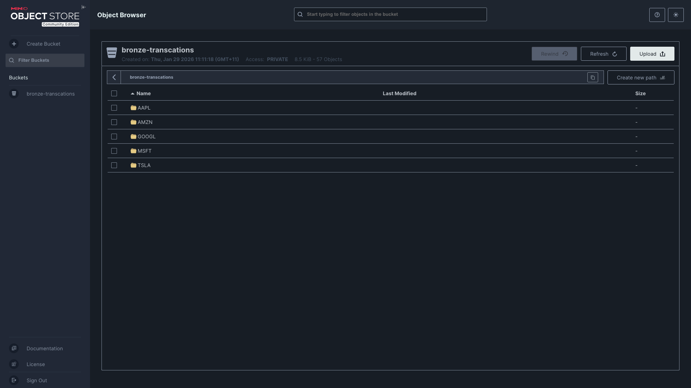
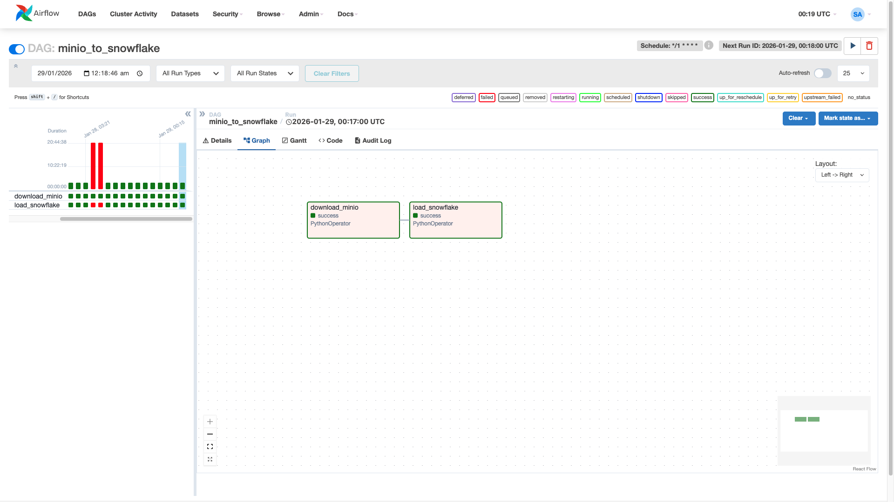

# ⚡ Real-Time Stocks Market Data Pipeline
### *Snowflake • dbt • Airflow • Kafka • Docker • Power BI*

---

## 📌 Project Overview
This project demonstrates an **end-to-end real-time data pipeline** using the **Modern Data Stack**. It captures **live stock market data** from an external API, streams it in real time, orchestrates transformations, and delivers analytics-ready insights — all in one unified project.

### 🏗 Architecture Diagram

---

## ⚡ Tech Stack
- **Snowflake** → Cloud Data Warehouse  
- **DBT** → SQL-based Transformations  
- **Apache Airflow** → Workflow Orchestration  
- **Apache Kafka** → Real-time Streaming  
- **Python** → Data Fetching & API Integration  
- **Docker** → Containerization  
- **Power BI** → Data Visualization

---

## ✅ Key Features
- Fetching **live stock market data** (not simulated) from an API.
- Real-time streaming pipeline with **Kafka**.
- Orchestrated ETL workflow using **Airflow**.
- Transformations using **DBT** inside Snowflake following a **Medallion Architecture** (Bronze → Silver → Gold).
- Analytics-ready **Power BI dashboards** connected via **DirectQuery**.

---

## ⚙️ Step-by-Step Implementation & Proofs

### **1. Kafka Setup & MinIO Data Lake**
  
* **Kafka:** Configured Apache Kafka locally via Docker to handle live stock events.
* **MinIO:** Built a Python consumer to store streaming data into **MinIO buckets** (S3-compatible) for raw layer ingestion.

### **2. Airflow Orchestration**
  
* Developed a DAG to load data from MinIO into Snowflake staging tables.
* Scheduled automated runs every **1 minute** to maintain real-time freshness.

### **3. Snowflake & DBT (Medallion Architecture)**
  
* **Bronze:** Staging raw stock quotes from the JSON source.
* **Silver:** Cleaning, validating, and casting data types.
* **Gold:** High-performance tables for analytics, including **Candlesticks**, **KPIs**, and **Volatility charts**.

### **4. Power BI Dashboard**
  
* Connected to Snowflake's Gold layer using **DirectQuery** to bypass transformation limitations.
* Features real-time candlestick charts, stock price trends, and live sortable KPI views.

---

## 🚀 Getting Started
1. **Clone the repository:** Initialize your environment.
2. **Setup Secrets:** Create a `.env` file in the `infra/` folder with your credentials.
3. **Build Infrastructure:** Run `docker-compose up --build -d`.
4. **Stream Live Data:** Run `python infra/producer/producer.py`.
5. **Orchestrate & Transform:** Use Airflow to load data and `dbt run` to build Gold tables.
6. **Visualize:** Connect Power BI to Snowflake.

---

## 📊 Final Deliverables
- Automated real-time data pipeline.
- Securely managed infrastructure with separated credentials.
- Transformed analytics models optimized for DirectQuery.

---

**Author**: *Suyash S Alekar*  
**LinkedIn**: [Suyash Alekar](https://www.linkedin.com/in/suyash-alekar-1715531a7/)  
**Contact**: suyashalekar.work@gmail.com
